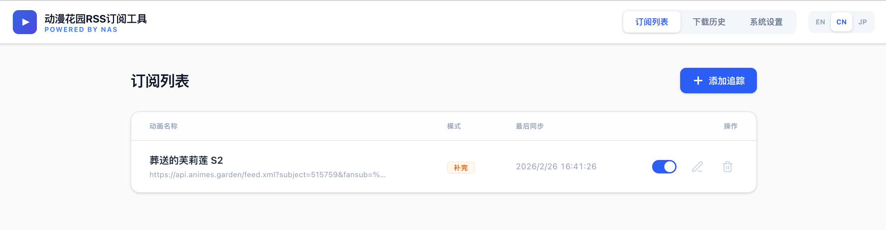
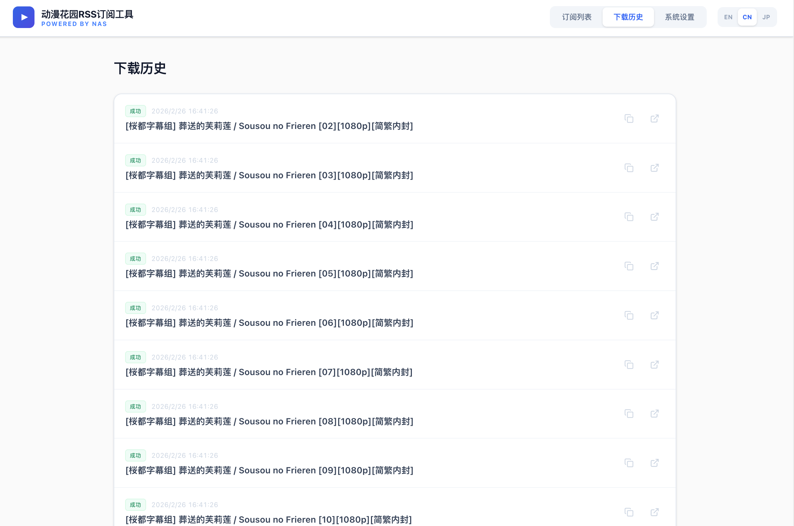
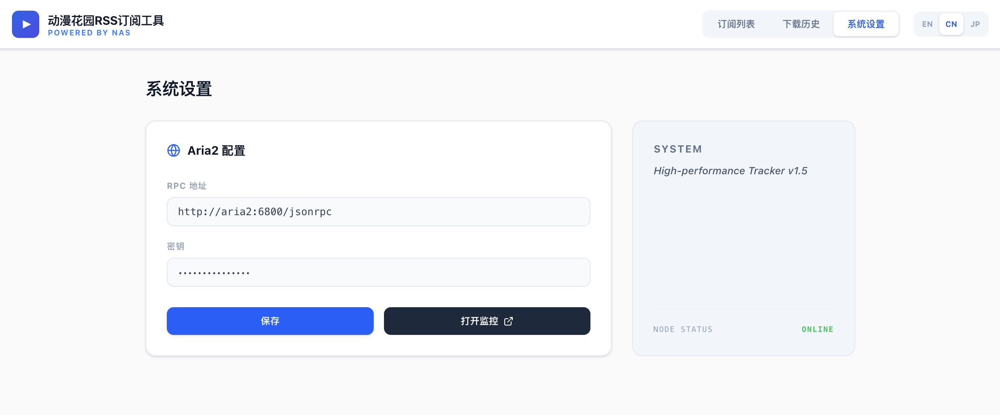

# 动漫花园RSS订阅工具 (Anime Garden RSS Subscription Tool)

[English](./README.md) | 中文说明

这是一个专为 NAS 环境设计的轻量化 Web 工具，旨在自动化从 `animes.garden` RSS 订阅源下载番剧。它可以监控订阅源、根据关键字（如“简繁内封”）进行过滤，并自动将磁力链接提交给 Aria2 或导出供其他下载器使用。

## 核心特性

- **🚀 极简主义交互**：采用 Apple 风格的清新排版，支持中/英/日三语切换并具备持久化记忆。
- **⚙️ 智能订阅管理**：支持滑动开关即时启停任务，可随时编辑订阅规则（名称、链接、关键字）。
- **🔍 精准关键字过滤**：支持包含关键字（如：`简繁内封`, `1080P`），精准锁定所需资源。
- **⚡ 即时同步响应**：新增、编辑或重新开启任务后，系统会立即触发一次后台同步，无需等待。
- **📥 灵活同步模式**：
  - **补完模式 (Archive)**：自动下载当前 RSS 中所有符合条件的条目。
  - **追踪模式 (Monitor)**：仅记录当前状态，仅下载未来发布的更新集数。
- **🔗 多下载器适配**：
  - **Aria2 直连**：通过 JSON-RPC 自动提交任务，支持免密一键跳转 AriaNg 监控面板。
  - **批量导出**：支持一键复制全部磁力链或导出为 `.txt` 文件，完美适配迅雷、极空间等。
- **🛠️ 性能与安全**：
  - **高性能后端**：配置内存缓存、连接池复用及异步线程池解析，响应极其丝滑。
  - **数据持久化**：数据库与 Aria2 配置安全存储在宿主机，镜像升级不丢失数据。
  - **Aria2 满速优化**：内置自动更新 Tracker 列表及 BT/PT 性能调优参数。

## 界面预览


*直观的任务列表，支持滑动开关与深度编辑。*


*紧凑实用的历史记录，支持批量复制与状态追踪。*


*居中简化的配置面板，支持自动认证的监控链接。*

## 快速开始

### 前提条件

- 已安装 Docker 和 Docker Compose。

### 部署步骤

1. 将仓库克隆到你的 NAS：
   ```bash
   git clone https://github.com/juju-w/nas_anime_garden_sub.git
   cd nas_anime_garden_sub
   ```
2. 编辑 `docker-compose.yml`，设置你的 `ARIA2_RPC_SECRET`。
3. 启动服务：
   ```bash
   docker-compose up -d --build
   ```
4. 通过浏览器访问 Web 界面：`http://<你的-NAS-IP>:8000`。

## 使用已有的下载器 (外部独立版)

如果你想使用 NAS 上**已有的 Aria2 实例**，请进入 **“系统设置”** 修改 RPC 地址（如：`http://192.168.1.100:6800/jsonrpc`）并保存。系统将立即切换到你的独立下载器。

## 性能优化建议

为了获得最佳的下载速度，建议在路由器上将 `51413` 端口（TCP 和 UDP）转发到你的 NAS 内部 IP。本工具会自动维护最新的 Tracker 列表以保持连接质量。

## 开源协议

MIT
